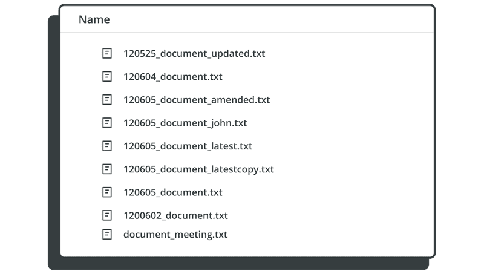
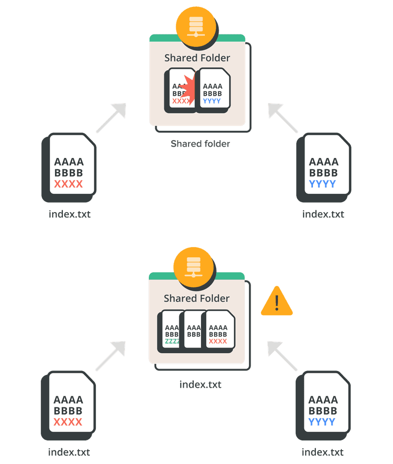

# 

```powershell
git --section 00 -msg "before we start" :)
```
##
> **OAD** / brian_li


# **A**genda
- Version Control
- What's Git
- CLI / GUI
- Resources


# **名詞**解釋
|名詞|簡述|
|---|---|
|**Git**|一種分散式「**版本控制**」|
|**GitHub**|一個提供多種服務的「**網站**」|
|**Repository**|儲存庫、程式庫，簡稱 `repo`|
|**Branch**|分支，一個 `repo` 可包含多個分支|
|**CLI**|Command Line Interface，例如 CMD|


# 


#


#


#


#


#


# **CLI** - Command Line Interface
|CMD|Git Bash|Terminal✅|VS2022|VSCode|ADS|
|-|-|-|-|-|-|
|||||||
###
>✅表示個人常用，後面三種開發工具也有內建CLI
熟悉指令對學習 Git 十分有幫助，建議從指令開始了解
<!-- _backgroundColor: #eee; -->

# **GUI** - Graphic User Interface
|[TortoiseGit](https://tortoisegit.org/)|[GitHub Desktop](https://desktop.github.com/)|[Sourcetree](https://www.sourcetreeapp.com/)✅|VS2022|VSCode|ADS|
|-|-|-|-|-|-|
|||||||
###
>各 GUI 操作邏輯、功能略有不同，但底層一樣都是 Git 指令
GUI 有自訂功能例如 **`Sync`** ≈ `pull` + `push` 或 **`Publish`** ≈ `remote` + `push`
<!-- _backgroundColor: #eee; -->

#
