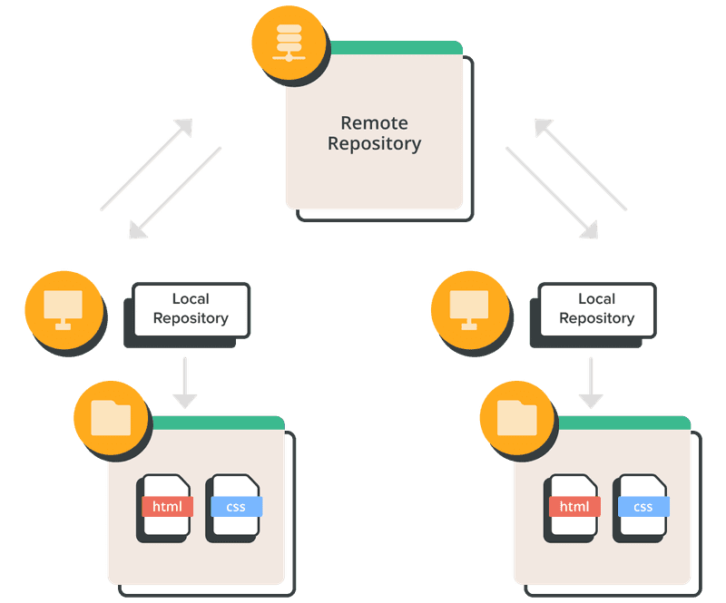
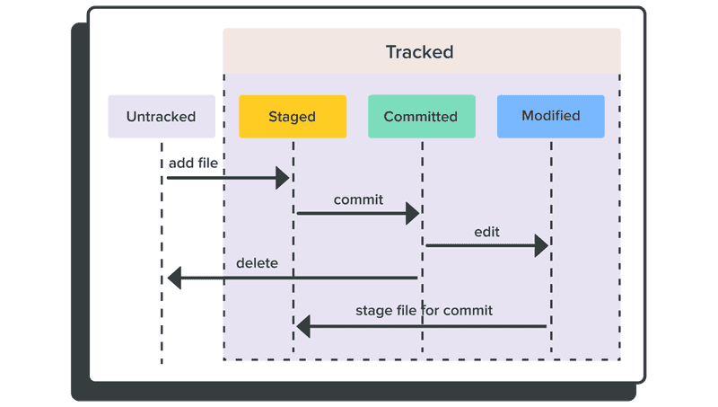
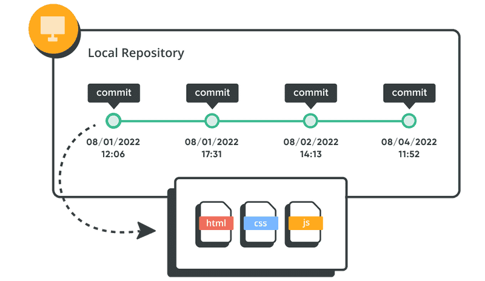
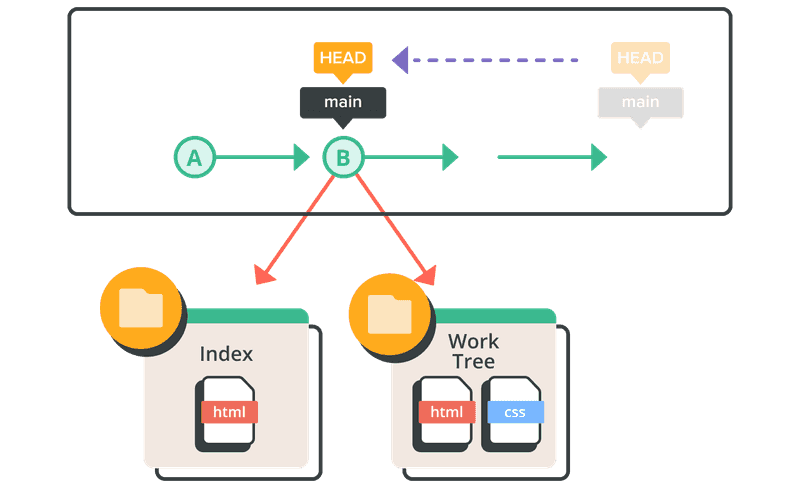
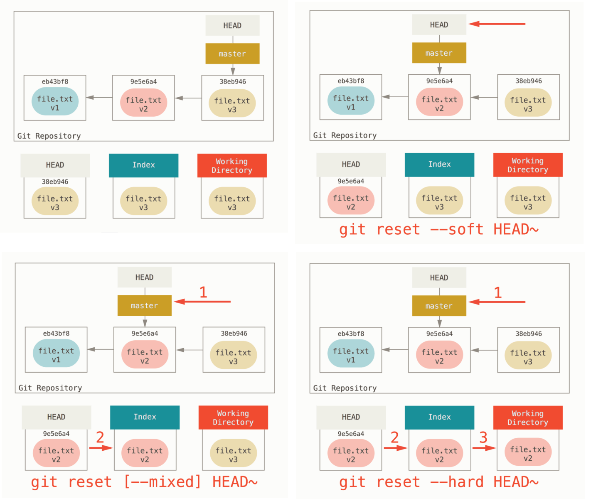

# 

```powershell
git --section 01 -cli "local repo" :D
```
##
> **OAD** / brian_li


# **A**genda
- What's Git
- CLI / GUI
- Local Repository
- Resources
- Homework 1


# **名詞**解釋
|名詞|簡述|
|---|---|
|**Git**|一種分散式「**版本控制**」|
|**GitHub**|一個提供多種服務的「**網站**」|
|**Repository**|儲存庫、程式庫，簡稱 `repo`|
|**Branch**|分支，一個 `repo` 可包含多個分支|
|**CLI**|Command Line Interface，例如 CMD|


# 


# **CLI** - Command Line Interface
|CMD|Git Bash|Terminal✅|VS2022|VSCode|ADS|
|-|-|-|-|-|-|
|||||||
###
>✅表示個人常用，後面三種開發工具也有內建CLI
熟悉指令對學習 Git 十分有幫助，建議從指令開始了解
<!-- _backgroundColor: #eee; -->

# **GUI** - Graphic User Interface
|[TortoiseGit](https://tortoisegit.org/)|[GitHub Desktop](https://desktop.github.com/)|[Sourcetree](https://www.sourcetreeapp.com/)✅|VS2022|VSCode|ADS|
|-|-|-|-|-|-|
|||||||
###
>各 GUI 操作邏輯、功能略有不同，但底層一樣都是 Git 指令
GUI 有自訂功能例如 `Sync` = `pull` + `push` 或 `Publish` = `remote` + `push`
<!-- _backgroundColor: #eee; -->

# CLI - **Repository**
|指令|中文|簡述|
|---|---|---|
|**init**|初始化|在 `local` 建立 `repo` 與預設分支*|
|**clone**|複製|下載整個 `remote repo` 到 `local`|
|**status**|狀態|檢視目前 `repo` 狀態|
###
> *[預設分支](https://www.ithome.com.tw/news/140094)後來由 `master` 改為 `main`


# DEMO - **Repository**
本地初始化
```powershell
git init
```
```powershell
git status
```
下載遠端 `repo`
```powershell
git clone https://xxx.yyy/zzz.git
```

<!-- _backgroundColor: #ddd -->

# Repository **.git**
- `git init` 之後產生
- 儲存 Git 相關資料
- 分為 local 與 remote


#


# CLI - **File**
##
|指令|中文|簡述|
|---|---|---|
|**add**|加入|將檔案加入暫存區，準備提交(尚未提交)|
|**commit**|提交|提交修改*至 `repo`，需填寫提交內容|
|**log**|歷程|檢視** `repo` 歷程記錄|
###
> *每次 `commit` 都會生成一個 `hash code`，例如 `c802b33`
**離開檢視請按 `q`，或者利用參數縮小範圍


# Git -**commit**


# DEMO - **File**
暫存區加入特定或全部 `untracked` 檔案
```powershell
git add code.txt
git add .
```
提交修改
```powershell
git commit -m "my first commit"
```
檢視歷程
```powershell
git log
git log --oneline --graph
```

<!-- _backgroundColor: #ddd -->

# Git - **HEAD**
- Git 的指標(指針)
- 指向當前 `branch`
- 或指向最新 `commit`
- 可搭配 `~n` 與 `^n`


# Git - **revert**
- 恢復至指定版本 `B`
- 產生新的版本 `B'`
- 不會複寫原紀錄 `C`


# Git - **reset**
- 回溯至指定版本 `B`
- 不會產生新版本
- 比 `B` 新的版本會消失
- 記得 `hash` 仍可救回


#


# **Online** Resources
- https://learngitbranching.js.org/?locale=zh_TW
- https://git-scm.com/book/zh-tw/v2/
- https://kingofamani.gitbooks.io/git-teach/content/
- https://jlord.us/git-it/index-zhtw.html
- https://www.youtube.com/watch?v=e9lnsKot_SQ


# What's **next** ...
##
|Subject|Keywords|
|---|---|
|**Branch**|`GitHub` `Gitea` `GitLab` `Azure DevOps`|
|**Remote**|`Git Flow` `GitHub Flow` `OAD Flow?`|
|**CI/CD**|`Action` `Pipline` `yaml`|
|**AI**|`GitHub Copilot CLI` `Commit Message Generator`|
|**Misc.**|`Pull Request` `Code Review`|


<!-- _class: invert -->

# Home**work** 1
- Install* Git from https://git-scm.com/download/win
- Install* a GUI or use CLI
- Clone repo from http://twoadcode:3000/brian_li/demoGit.git
- Create your own directory `D` (with your name)
- Create a text file `T` in `D`, such as `*.txt` `*.sql` `*.js` `*.cs`
- Write something in `T` and save
- Add `T` to the stage area
- Commit (to repo)
- Capture screen and mail to [Mecer](mailto:mecer.wu@sgs.com)

> *probably need IT support


# 😀 Thank you !
feel free to ask if you have any other questions.
##
> **OAD** / brian_li / #1429
brian.li@sgs.com
