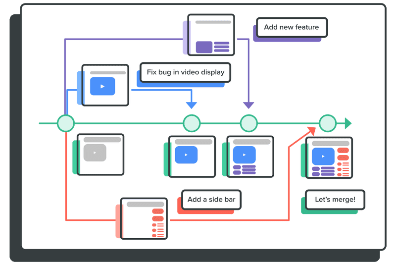

# 

```powershell
git --section 02 -branch "remote repo" :(
```
##
> **OAD** / brian_li


# **A**genda
- Branch
- Remote Repository
- FETCH
- Resources
- Homework 2


#


# CLI - **Branch**
##
|指令|中文|簡述|
|---|---|---|
|**branch**|分支|建立分支，需提供分支名稱|
|**checkout**|簽出|切換到指定分支，需提供分支名稱|
|**switch**|切換|同上，於 `Git 2.23` 後提供|
|**merge**|合併|以**目前分支**併吞其他分支|
###
> *Git 指令永遠都是針對 `目前分支` 進行操作


# DEMO - **Branch**
建立分支
```powershell
git branch dev
```
切換分支
```powershell
git checkout dev
git switch dev
```
合併分支 
```powershell
git swtich main
git merge dev
```
> ⚠️注意當前分支是否為 `main`

<!-- _backgroundColor: #ddd -->

# CLI - **Remote**
##
|指令|中文|簡述|
|---|---|---|
|**remote**|遠端|管理遠端分支*|
|**push**|推送|上傳修改資料到遠端|
|**pull**|拉取|下載修改資料到本地|
|**fetch**|擷取|下載修改資料到**追蹤分支**|
###
> *遠端 `repo` 預設別名為 `origin`


# Git - **Tracking** Branch
- 與遠端分支關聯的**本地分支**
- `origin` = 遠端 `repo`
- `origin/main` = 遠端 `main` 的追蹤分支
- 追蹤分支**僅**用來反映其遠端分支變化
- 關於遠端的**指令***會影響追蹤分支
- 本地**無法**直接操作追蹤分支
###
> *例如 `clone` `push` `pull` `fetch` 等
**左為 `ftech` 示意，僅更新追蹤分支


# DEMO - **Remote**
設定遠端 `repo`
```powershell
git remote add origin https://xxx.yyy/zzz.git
```
推送資料*
```powershell
git push -u origin main
```
拉取資料 = `fetch` + `merge`
```powershell
git pull
```
> *設定上游為 `origin/main`，未來 `push` 即可

<!-- _backgroundColor: #ddd -->

# Why need **FETCH** ?
- **查看遠端更新**
    不須合併即可檢視遠端修改歷程
- **比對分支差異**
    透過 `diff` 比對，預覽合併結果
- **保持資料同步**
    定期執行，避免合併時大量變更


# 取消提交

# **Online** Resources
- https://www.toptal.com/developers/gitignore
- https://heidiliu2020.github.io/git-commit-message/
- https://www.youtube.com/watch?v=0chZFIZLR_0
## **Offline** Resources
- https://www.tenlong.com.tw/products/9789864342662
- https://www.tenlong.com.tw/products/9789865025274


# Home**work** 2
- Back to the local repo
- Create a branch `B` with your name
- Make some chagnes, then commit
- Merge `B` into `main`
- Pull data from remote repo*
- Push `B` to remote repo
- Review Git logs
- Capture screen and mail to [Mecer](mailto:mecer.wu@sgs.com)
###
> *`pull` before `push` to avoid diff version warning


# What's **next** ...
##
|Subject|Keywords|
|---|---|
|**Git Server**|`GitHub` `Gitea` `GitLab` `Azure DevOps`|
|**Work Flow**|`Git Flow` `GitHub Flow` `OAD Flow?`|
|**CI/CD**|`Action` `Pipline` `yaml`|
|**AI**|`GitHub Copilot CLI` `Commit Message Generator`|
|**Misc.**|`Pull Request` `Code Review`|


<!-- _class: invert -->

# 😀 Thank you !
feel free to ask if you have any other questions.
##
> **OAD** / brian_li / #1429
brian.li@sgs.com
