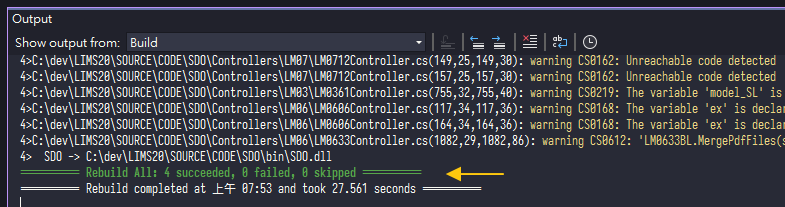
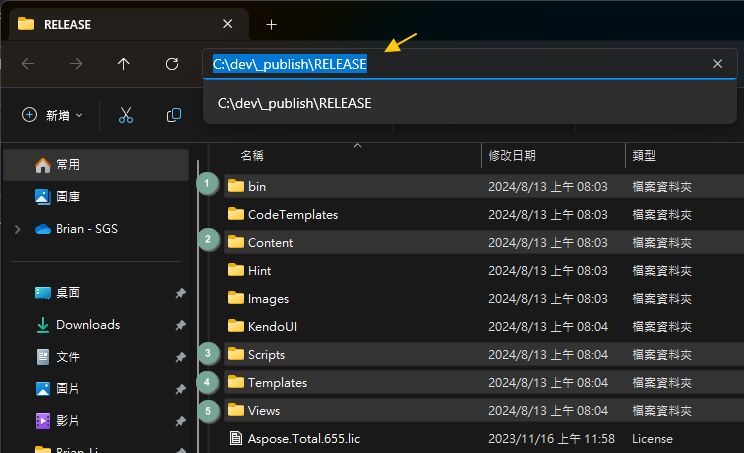
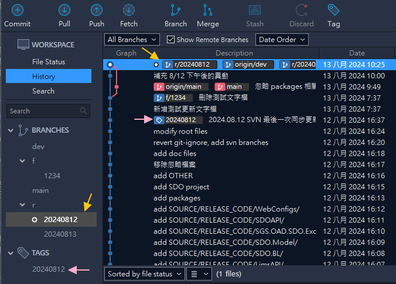

# 🌞每日版本更新 Daily Update

- LIMS 2.0 每天有專人輪值確認是否有版本需要更新
- 負責人需拉取 `pull` 最新版本 `dev`，若無衝突會自動合併
- 通常會建議先擷取 `fetch` 再合併 `merge` (`pull` = `fetch` + `merge`)
- 先 `fetch` 可預先了解是否衝突 `conflict`，盡早處理

# 📊流程圖

# 📥拉取 Pull

- `fetch` 後，更新了遠端分支(在本地的追蹤分支) `origin/dev`
- 遠端分支領先了兩個版本(兩個 `node`)，Sourcetree 提示可以拉取 `pull`

- 因確認不會衝突，就直接進行拉取 `pull`
- 拉取要注意來源與對象(分支)，確認無誤後按 Pull

>⚠️如果有衝突，也會在合併時候擋下，發生了再處理就好

- 完成後可發現 `dev` 與遠端 `origin/dev` 已經為同一版本
- 確認所在分支為 `dev` 後，進行下一個步驟

# 🔧編譯 Build

- 使用 Visual Studio 2022 開啟專案，執行編譯 `Build`
- 也可執行重建 `Rebuild`，比較乾淨
- 確認可正常編譯完成(如上圖所示)

# 🚀發布 Publish

- 編譯完成後進行發布(部署)
- 雖然發布時也會編譯，但仍建議先編譯確認沒有問題
- 發布完成後前往發布目標路徑 Target Location

>💡編譯與發佈操作可用指令取代，減少開啟 IDE 與操作時間，提升效率

# 🗂️複製貼上 Copy & Paste

- 開啟發布路徑後，複製五個必要資料夾
- 如有其他例外請自行加入，例如 ClientAPi 或 Web.Config 等

- 將複製檔案貼到測試機進行更新
- `001` `\\twtpeoad001\SGS_WEB\SGS\`
- `002` `\\twtpeoad002\SGS_WEB\SGS\`

>⚠️原本也需要將檔案貼到 `\\twfs007\OAD_Lims2Team\{yyyymmdd}\` 的流程應該可以不用了，因為未來是另外依照 BU 測試結果推送分支合併 `main`，而非從此路徑複製整合 
💡複製貼上可用指令 `robocopy` 取代，加上參數可大幅提升作業效率

# 🧪測試與回報 Test & Report

- 連線測試機並確認可以登入，如可測試上版功能更好
  - http://twtpeoad001/SGS/
  - http://twtpeoad002/SGS/
- 測試完畢於 Teams 回報，即完成當日更新作業

# 🏷️版控個人管理 (建議非強制)

- 一般日常更新，直接在 `dev` 分支下去編譯發布即可，順順的都不會有問題
- 但如果遇到例如「週三臨時需要將測試機還原到周一版本」有可能會不知道要用哪個 `node`
- 以下提供一些建議作法

- 這邊的發行是指將 `dev` 發佈到 `測試機`，非發行正式版本
- 確認 `dev` 已經是最新版本後 (完成拉取並確認可編譯)
- 建立名為 `r/年月日` 的分支，前綴 `r` 為 `release` 縮寫

- 建立完成後同樣會在 Sourcetree 左側看到，並會依照前綴 `r/` 自行歸類
- 如此一來便可保留當天更新版本，可依照每次更新自行留底
- 如果要還原到 `20240812`，只要切換到分支 `r/20240812`，再進行版更流程即可
- 另一個做法是用 `tag`，`tag` 就像便條紙，標註這個 `node` 相關訊息
- 這邊我寫上日期，表示當天是使用這個 `node` 進行版更
- 如果要測試機要回溯，可以臨時先點到這個版本，更新完畢記得回復

- 發行分支的命名並無明確規範 (就是分支)，要使用 `release` 也可以
- 同理，如覺得會與正式機混淆，使用 `uat` 也完全沒問題
- 💡個人會先採用 `r/20240812` 作法

>⚠️版更會輪值並每天更新，如幾天後沒問題即可刪除發行分支，特定目的(測試用)又會持續更新覆蓋的資料，理應不用長久保留，當然，也不用推送到遠端