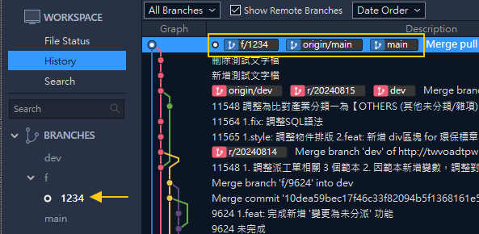
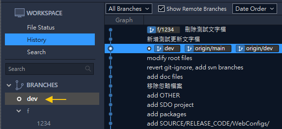
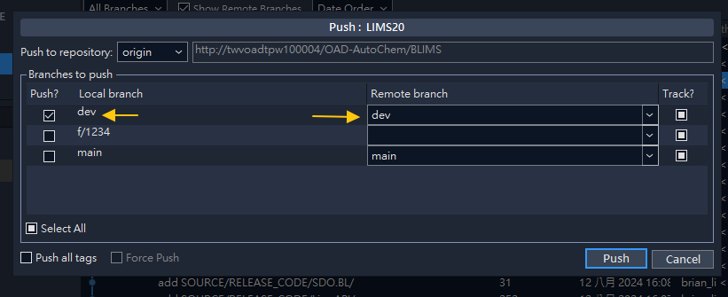

# 💻日常功能開發 Feature Develop

# 🚨文件修改完成期間，如看到 `dev` 請一律先當成 `uat`，表示要發佈到測試機的更新分支

- 描述 `PG` 日常開發功能流程
- 首先 `pull main`，更新穩定分支 `main` 到最新版本
- 接著取得 `SA` 開立 `mantis` 單號
- 依照單號，由 `main` 建立開發分支 (使用上方工具列 `Branch`)
- 確認已切換到新分支，開始進行開發

# 📊流程圖

# 🌱建立功能開發分支 Create (Feature) Branch

- ⚠️注意目前分支是否為 `main` (或者其他穩定分支)
- 輸入分支名稱，使用前綴 `f/` 加 `mantis單號`
- 按 `Create Branch`

- 分支建立完成時，會與其起始分支內容相同 (同版本、同節點)
- 例如上圖 `f/1234` 和 `main` 會在同一個節點 `node` 上
- Sourcetree 左側也會出現分支，如果有前綴詞則會自動分類

# 🛠️完成功能開發 Finish Feature

- 分支開好後，即可(在分支上)開始進行功能開發
- 完成後記得 `add` 並 `commit`，同時撰寫 commit message
- 下圖是一個完成功能示例圖，提交了兩次修改 = 兩次 `commit`

- 可以看到 `f/1234` 領先了 `main` **兩個**版本 (或說兩個 `node`)

# 🔄合併分支 Merge (Feature) Branch

- ⚠️開發完畢需將修改併入 `uat`，以便更新到測試環境(UAT)
- Git 並沒有併入 `merge into` 這種行為 (指令)
- 所以實際是先切換 `checkout` 到 `uat`，然後合併 `merge` 分支 `f/1234`

- Sourcetree 左側選單點兩下 `uat` 即可切換分支
- 🚨注意切換前如有未完成修改請先 `commit` 或者加入 `stash`

>如用 CLI 指令可執行 `checkout` 或 `swtich`

- 確認目前分支為 `dev`
- 點選 Sourcetree 上方 Merge 按鈕
- 選擇要併入的分支(或者說節點)進行合併，此為 `f/1234`

- 合併完成後，會看到 `dev` 已經與 `f/1234` 在同一個 `node`
- 表示 `dev` 已包含 `f/1234` 修改內容
- Sourcetree 會提示可進行 `push` (表示 `dev` 與 `origin/dev` 有版本差異)

# 🚀推送更新 Push

- 推送 `push` 本地的修改歷程到遠端
- 每日版更人員即可取得資料並進行版更

- 點選 Sourcetree 上方工具列 Push
- 勾選分支 `dev` 後點選 Push 按鈕

- 完成推送後，遠端(的追蹤)分支 `origin/dev` 應該與本地版本一致
- 到此便完成一個功能的開發，版更人員拉取遠端 `dev` 即可取得更新

# ⚠️注意事項

- 推送 `push` 資料時，如版本差異，Sourcetree 應會提示警告
- 建議平常就執行 `fetch` 更新追蹤分支 `origin/dev` 如有衝突比較能第一時間解決