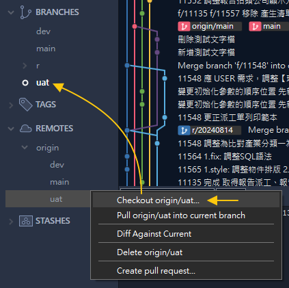

# 🆕初次使用 First Use

- 第一次(或重新開始)準備 LIMS 開發環境時可參考
- 例如換電腦或初次加入開發團隊

# 📊流程圖


# 🌐遠端儲存庫 Remote Repository

```
http://twvoadtpw100004/OAD-AutoChem/BLIMS.git
```

- 確認可存取以上網址 (需登入)
- 如無法登入，請聯繫 OAD Git Server 管理人員

# ⬇️下載儲存庫 Clone Repository


- 使用 Sourcetree Clone 功能進行下載
- 本機路徑請自行管理，一般放到 `C:\dev\` 之下
- 預設會簽出 `checkout` 預設分支 Default Branch，通常是 `main` 或 `master`

# ✅簽出版更分支 Checkout `uat` Branch



- 配合開發流程需要，也要簽出 `uat`
- 使用 Sourcetree 自行 `checkout`
- 找到 REMOTES 之下的 `origin/uat`，右鍵選擇 `checkout`

# 💻開發專案 Develop Project

- 請使用 `~/SOURCE/CODE` 內的專案開發
- 請使用 VS2022 開啟 `SDO.sln` 並進行編譯
- 初次編譯因為需 restore 套件會比較久，之後就會快一點
- 確認可成功編譯後，即完成開發專案下載與建置流程

>⚠️版更不再使用 `RELEASE_CODE` 目錄，改為分支管理

# 💡其他補充

- 參與開發必須 `checkout` `main` 與 `uat`
- 每日更新僅需 `checkout` `uat`
- 每周更新僅需 `checkout` `main`