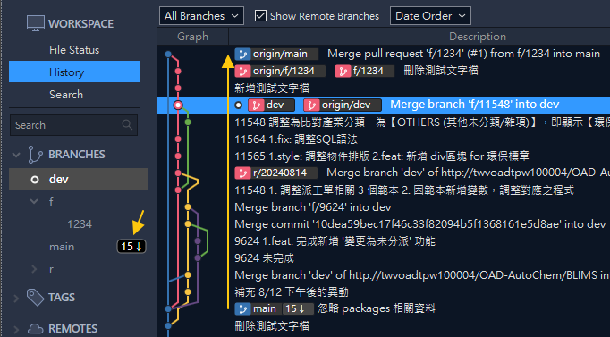
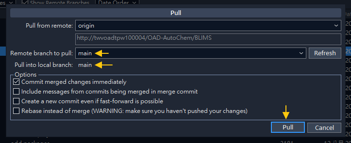

# 每周更新 Weekly Update (IT)

- 本文描述每周更新的後半段，包含：
  - 取得 `main` 更新紀錄，進行編譯與發佈
  - 透過 `PM` 通知 `IT` 進行正式機版本更新

# 📊流程圖

# 拉取正式版本分支 Pull Main Branch

- 回到 Sourcetree 進行 `fetch`，可看到 `main` 有多個紀錄可拉取
- 稍早在遠端的操作，都已經反映到 `origin/main`

- 執行拉取 `pull` 取得提交紀錄 (建議先切換到 `main`)
- ⚠️務必確認 local 與 remote 的分支對象是否正確