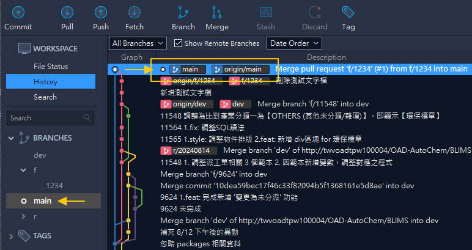
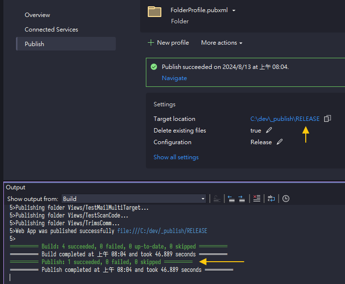
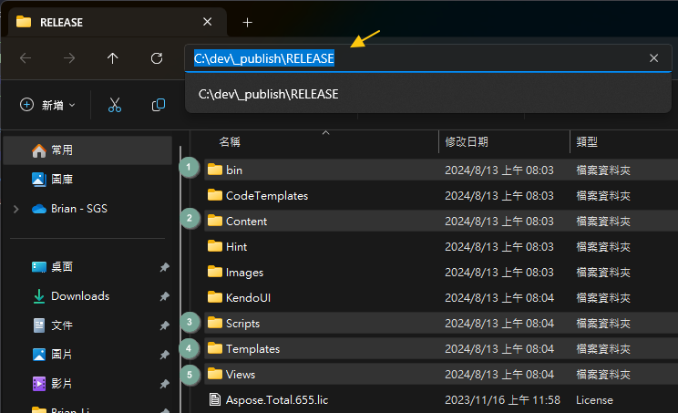

# 📅每周更新 Weekly Update (IT)

- 本文描述每周更新的後半段，包含：
  - 取得 `main` 更新紀錄，進行編譯與發佈
  - 透過 `PM` 通知 `IT` 進行正式機版本更新

# 📊流程圖

# 📥拉取主要分支 Pull `Main` Branch

- 回到 Sourcetree 進行 `fetch`，可看到 `main` 有多個紀錄可拉取
- 稍早在遠端的 Pull Request 操作，都已經反映到 `origin/main`

- 先切換到 `main`
- 執行拉取 `pull` 取得提交紀錄
- ⚠️務必確認 local 與 remote 的分支對象是否為 `main`

- 完成後可發現 `main` 與遠端 `origin/main` 已經為同一版本 (同一個 `node`)

# 🌱每週版更分支 Weekly Update Release Branch
- 每週版更建議使用分支管理
- 可建立例如 `r/20240808` 之分支，代表更新 `20240808` 版本
- 前綴 `r/` 表示 `release`，意旨**發行**正式機之分支
- ❌以往規則：
  - 隔週檢視上周每日更新檔
  - 人工依序複製每日更新檔，貼上整合為週更新檔
- ✔️未來改為：
  - `pull` 最新版本 `main` (已合併所有提交 `PR`)
  - 接續執行後面步驟，透過編譯與發佈取得週更新檔

>💡如果有把握記住是哪個節點 `node` 更新，不開分支也可以

# 🔧編譯 Build

- 使用 Visual Studio 2022 開啟專案
- ⚠️務必確認目前分支為 `main`
- 執行編譯 `Build`，也可執行重建 `Rebuild`，比較乾淨
- 確認可正常編譯完成 (如上圖所示)

# 🚀發布 Publish

- 編譯完成後進行發布(部署) `Publish` (目標路徑設定因人而異)
- 發布完成後開啟目標路徑 `Target Location`

>⚠️雖然發布時也會編譯，但仍建議上一個步驟先重建確認沒有問題 
>💡編譯與發佈操作可用指令取代，減少開啟 IDE 與操作時間，提升效率

# 🗂️複製貼上 Copy & Paste

- 開啟發布路徑後，複製五個必要資料夾
- 前往週更新資料夾 `\\twfs007\OAD_Lims2Team\`
- 建立週更新目錄 `yyyymmdd`，建立 `CODE` 目錄，並貼上五個資料夾

# 🔄後續更新流程

- 將資料放入週更新目錄後，即與原本 LIMS 更新正式機流程相同
- 相同流程不再贅述，暫時依照原本程序執行即可 (即通知 `PM` `IT` 等)

>⚠️未來如有機會導入 CI/CD，有機會省去這些人工作業時，再行規劃調整

# 📝補充：常見更新例外處理

⚠️以下各項流程尚未制定與演練，可能會有異動

## ⚙️Web.config

- 於週更新目錄 `yyyymmdd`，建立 `Webconfig` 目錄
- 將所有修改過的 `Web.config` 放入其中

## 🌐ClientAPI

- 於 `CODE` 目錄下建立 `Uploads` 目錄
- 將編譯好的執行檔與備份檔放入其中

## 📄SQL Script

- 於週更新目錄 `yyyymmdd`，建立 `DB` 目錄
- 將 `*.sql` 檔案放入其中