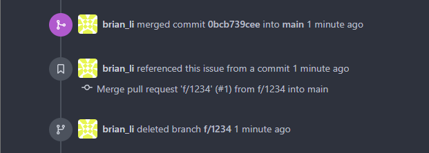

# 📅每周更新 Weekly Update (OAD)

# 🚨文件修改完成期間，如看到 `dev` 請一律先當成 `uat`，表示要發佈到測試機的更新分支

- 每周更新分為兩個部分 `OAD` 與 `IT` 兩部分說明
- `OAD` 部分包含
  - `PG` 提交所有測試通過分支
  - `PG` 於遠端 `Git Server` 建立 `Pull Request` 
  - `SA` 於遠端 `Git Server` 進行 `Code Review`

# 📊流程圖

# 🧪測試結果 Test Result

- `BU` 測試完畢，通知 `SA` 結果
- `SA` 收到測試報告後通知 `PG`：
  - 測試通過之功能，請推送 `push` 其功能分支
  - 測試未通過之功能繼續修改，或結案另行開單
- 本文使用上圖 `f/1234` 通過測試為例進行後續說明

# 📤推送分支 Push (Feature) Branch

- `PG` 收到 `f/1234` 通過測試
- 找到自己負責的分支 `f/1234` (不用切換過去)

- 點選 Sourcetree 上方 `Push` 功能
- ⚠️確認推送分支為 local `f/1234` 到 remote `f/1234`
- ⚠️可複選一次推送，務必確認是 `SA` 公告**測試通過**之分支才可勾選

- 完成之後 Sourcetree 會出現追蹤分支 `origin/f/1234`
- 如此表示遠端 `RTEMOTE` 的分支 `f/1234` 應也建立完畢

# 🌐前往遠端 Go to Git Server

- 前往遠端 `http://twvoadtpw100004/OAD-AutoChem/BLIMS`
- 發現系統自動提示已經推送分支，並可直接建立 Pull Request
- 同時也可觀察到遠端儲存庫多了一個分支 (正常應該只有 `main` 與 `uat` 兩個)

>💡系統提示有時間限制，超過太久就不會顯示。如果沒有看到，可直接點選儲存庫首頁上方 `Pull Requests` 頁籤，裡面也可建立 Pull Request

- 點進去可以看到 `f/1234` 這邊也可建立 Pull Request
- 確認無誤後即可點擊 `New Pull Request`

# 📩建立 Pull Request

- 點選 `New Pull Request` 功能後會先進到一個預覽畫面
- 這邊要再次確認 `merge into` `main` 與 `pull from` `f/1234` 目標是否正確
- 下方也顯示了這個分支包含的提交紀錄，確認無誤再次點選 `New Pull Request`

>⚠️這邊因為測試重建分支，包含了他人修改紀錄，正常應該只有該功能的紀錄才對

- Pull Request 包含**標題**與**內容**，標題預設為分支名稱
- 內容沒有規範，留白或自行補充都可以，支援 Markdown 語法
- 編輯完畢後按 `Create Pull Request` 即可完成建立

# 👥加入審視人員 Add Reviewer

- 點選右上角的 `Reviewers` 可設定審視人員(多選)
- 勾選完畢按一下其他地方離開，稍後即可看到設定完畢

>⚠️設定審視人員或於 PR 編輯時 `@人員` 理論上都會收到 email 通知，但該主機目前 email 功能無效，所以不會收到通知

# 🧐檢視程式碼 Code Review

💡審視人員 (暫時默認為 `SA`) 可從這邊開始看

- PR 的上方，可檢視包含的 Commits 與 File Changes
- 點選每個 Commit 的 SHA1 可以檢視修改內容

- File Changes 則可一次檢視所有修改檔案內容 (不分 commit)
- 可以在此進行 Code Review

# 🔀合併提交 Merge Commit

- 再完成必要之審視、討論與(可能有)來回修改之後
- 回到 PR 討論最下方，點選 `Create merge commit`

- 顯示 Merge Commit 編輯畫面，Merge Commit 也是一個 `commit`
- `commit` 包含標題與內容，會預設產生，可自行補充
- 此例為合併到 `main`，合併後即正式上線，應不再需要 `f/1234`，故勾選刪除

- 完成畫面顯示如上，，分支已經 `Merged` 並且刪除 `deleted`

- 上述相關操作紀錄均會保留
- 至此即完成 OAD 主要週更新流程

# 🗑️刪除分支(非必要) Delete (Feature) Branch

- 回到 Sourcetree，由於功能已經正式上線 (併入 `main`)
- 可考慮刪除分支 `f/1234`