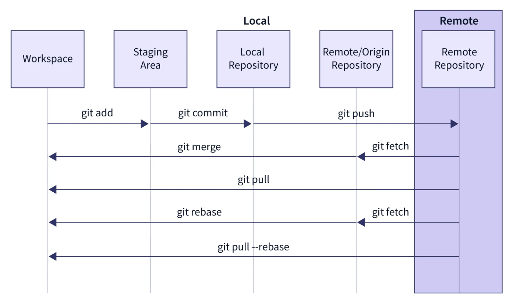
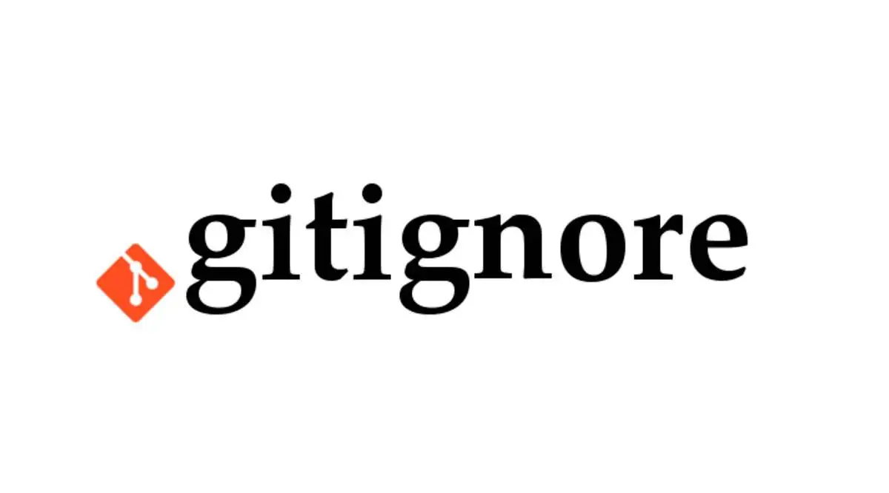
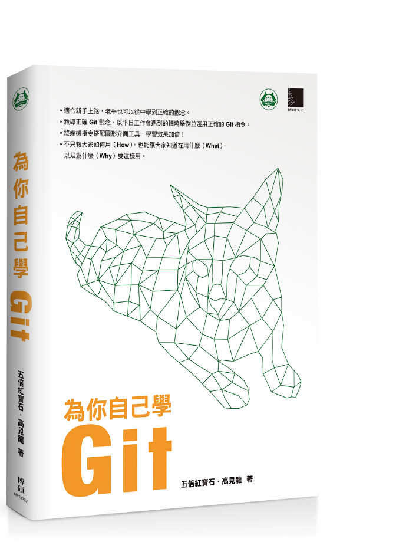
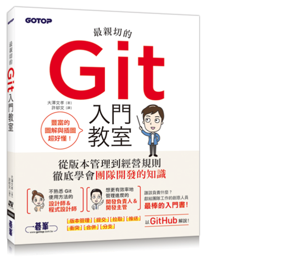

#####  Qucik Start
###
```bat
git quick-start "from zero to git" ✨
```
#
#

`OAD` **Brian Li**

---


## **適合**對象

- SGS Taiwan 同仁
- 幾乎或不曾使用過 Git
- 工作上需要進行版本控制

## 預期**目標**

- **最快**速度入門以下項目
-  **Git** 基礎知識
-  **Sourcetree** 基礎操作
-  **Gitea** 基礎功能使用

---


# **A**genda
  
-  **Git**
  基礎知識
  常見指令

-  **Sourcetree**
  安裝流程
  基礎操作

-  **Gitea**
  功能分享
  建立儲存庫

---


## **Git**

- 一套開源的分散式版本控制軟體
- 本機安裝即可使用，不需要網路

## **GitHub**

- 一個提供多種服務的網站
- 需要註冊方可使用，使用時需要網路

## **Gitea**

- 開源專案，功能與畫面類似 GitHub 
- 可於封閉網路環境部署，適合企業使用

---



---


#  常見**指令**說明

```sh
# 初始化 local repo (僅初次執行需要)
git init

# 查看 local repo 狀態
git status

# 將所有 unstaged 檔案加入 stage
git add .

# 提交(commit)修改到 local repo
git commit -m "{message}"
```
###
>💡 `repo` 全名為 Respository，中文常稱為程式庫、儲存庫 (不限定只能放程式)

---


#  常見**指令**說明

```sh
# 下載 remote repo (僅初次執行需要)
git clone {htt://url/repo.git}

# 拉取 remote repo 提交紀錄
git pull

# 推送 local 提交記錄至 remote
git push
```

###

- 擷取 `fetch` 也是一個重要指令
- 追蹤分支 `Tracking Branch` 可同步了解

---



# 開始**之前** ... `.gitignore`

- 一個純文字檔
- 忽略特定目錄或檔案
- 防止不必要的文件提交

```powershell
.vs    -------------------- #本地資料
bin/   -------------------- #編譯檔案
*.log  -------------------- #日誌
*.user -------------------- #個人組態
[Pp]ackages --------------- #套件目錄
```
- [](http://twvoadtpw100004/brian_li/SGS.OAD.GitTraining/src/branch/main/asset/video/git-ignore.mp4) 建議使用 https://gitignore.io/

>⚠️ 如果版控中途新增此檔，不會影響已經加入版控 `Tracked` 的資料

---


#  Sroucetree

https://www.sourcetreeapp.com/

- 免費可商用的 Git GUI 工具
- 可執行常見的 Git 操作
- 查看提交歷史紀錄與分支圖表
- 適合 Git 初學者，無需記憶 CLI
- 支援 [Git-Flow](https://gitbook.tw/chapters/gitflow/why-need-git-flow)

---


#  Demo

- [](http://twvoadtpw100004/brian_li/SGS.OAD.GitTraining/src/branch/main/asset/video/st-download.mp4) **下載** Sourcetree
- [](http://twvoadtpw100004/brian_li/SGS.OAD.GitTraining/src/branch/main/asset/video/st-install.mp4) **安裝** Sourcetree*
- [](http://twvoadtpw100004/brian_li/SGS.OAD.GitTraining/src/branch/main/asset/video/st-create.mp4) **建立** `Create` 本地儲存庫
- 本地儲存庫**基本操作**
  [](http://twvoadtpw100004/brian_li/SGS.OAD.GitTraining/src/branch/main/asset/video/st-add-and-commit.mp4) 新增檔案，提交變更
  [](http://twvoadtpw100004/brian_li/SGS.OAD.GitTraining/src/branch/main/asset/video/st-mdf-commit.mp4) 修改檔案，提交變更
- [](http://twvoadtpw100004/brian_li/SGS.OAD.GitTraining/src/branch/main/asset/video/st-add.mp4) **加入** `Add` 本地儲存庫

###

>*⚠️安裝過程需輸入帳號與email

---


#  Gitea

https://about.gitea.com/

- 一個提供 Git repo 託管的網站
- Go 撰寫、開源、`MIT` 授權
- 介面類似 GitHub，學習曲線低
- 適合小型團隊、企業內部使用
###
💡 額外提供了許多功能...

`HTTPS` `SSH` `Wiki` `issue tracking` `pull request` `web hooks` `Actions`

---


#   Demo

 **Git Server**
  http://twvoadtpw100004/
  [](http://twvoadtpw100004/brian_li/SGS.OAD.GitTraining/src/branch/main/asset/video/gt-create-repo.mp4) **建立**遠端儲存庫
###
 遠端儲存庫**基本操作***
[](http://twvoadtpw100004/brian_li/SGS.OAD.GitTraining/src/branch/main/asset/video/st-clone.mp4) **下載** `Clone` 遠端儲存庫到本機
[](http://twvoadtpw100004/brian_li/SGS.OAD.GitTraining/src/branch/main/asset/video/st-push.mp4) **推送** `Push` 本機修改紀錄到遠端
[](http://twvoadtpw100004/brian_li/SGS.OAD.GitTraining/src/branch/main/asset/video/st-pull.mp4) **拉取** `Pull` 遠端儲存庫修改紀錄

###

>*⚠️ 初次與遠端互動會進行驗證

---

### 🌐 **Online** Resources
- https://learngitbranching.js.org/?locale=zh_TW
- https://git-scm.com/book/zh-tw/v2/
- https://gitbook.tw/chapters/gitflow/why-need-git-flow
- https://github.com/geekan/HowToLiveLonger
- https://github.com/ByteByteGoHq/system-design-101
- https://youtu.be/FKXRiAiQFiY?si=5FloUV7xYN-I_MsV
### 📚 Book**s**
- https://www.tenlong.com.tw/products/9789864342662
- https://www.tenlong.com.tw/products/9789865025274



---


# 😀 Thank you !

feel free to ask if you have any other questions

#

🏢 **OAD** 
👤 Brian Li
📞 `#1429`
📧 brian.li@sgs.com