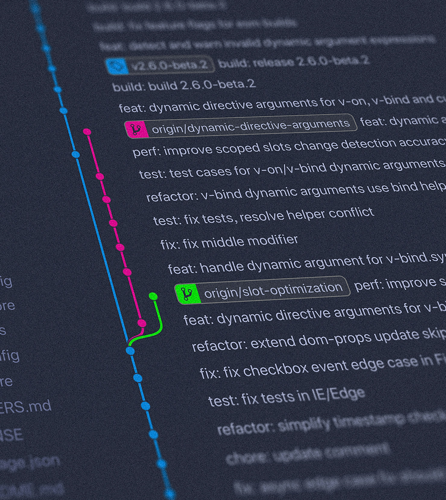
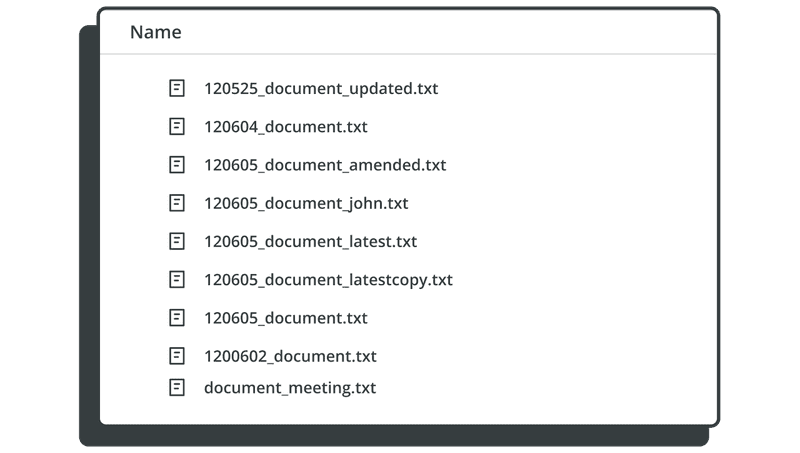
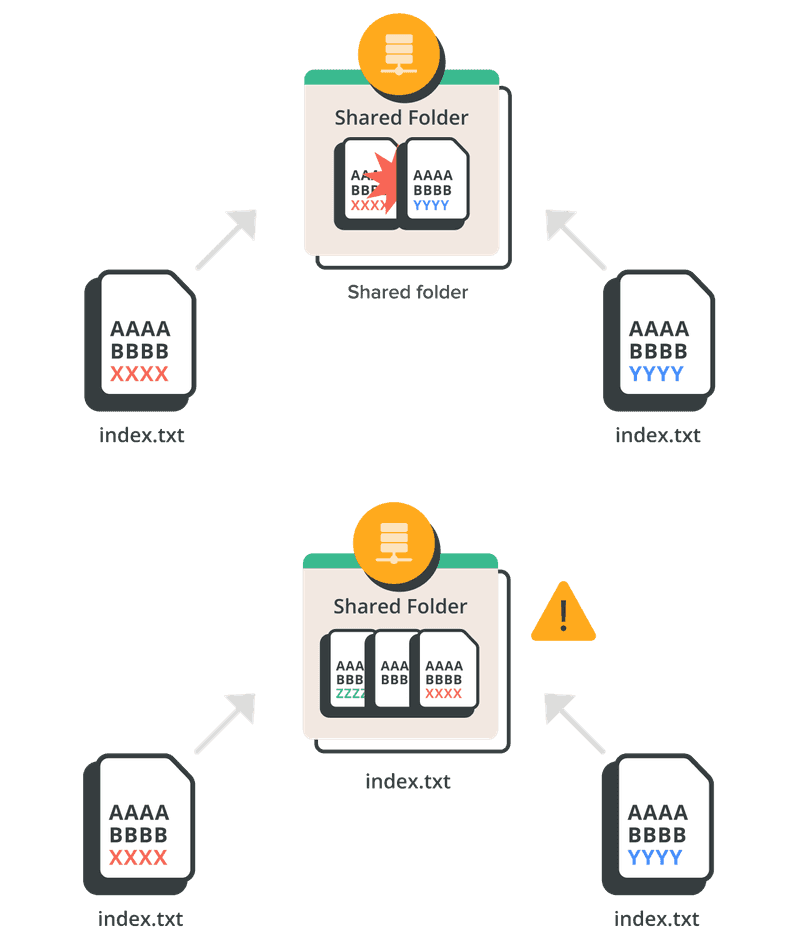
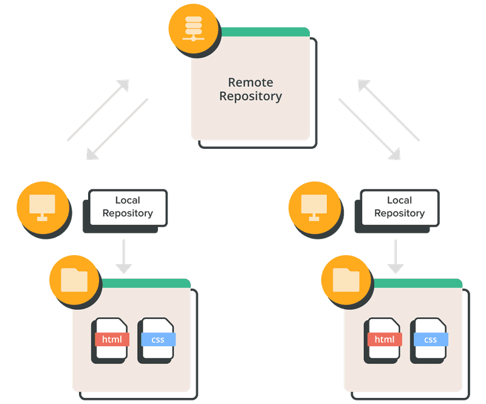
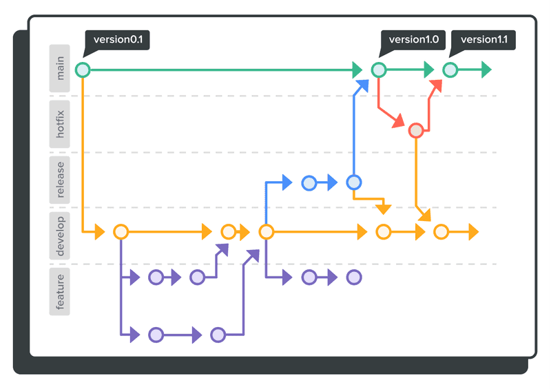
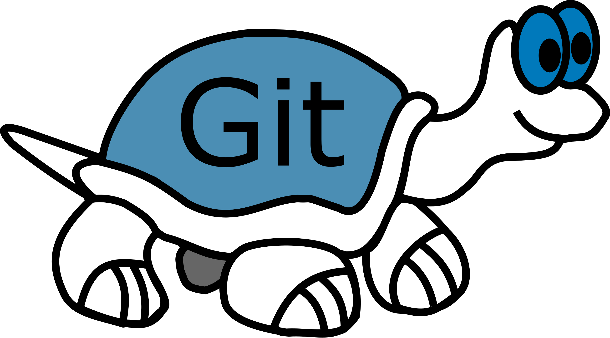

---
marp: true
paginate: true
headingDivider: 1
footer: git-section-`00`
---

# 

```powershell
git --section 00 -msg "before we start" :)
```
##
> **OAD** / brian_li


# **A**genda
- Version Control
- What's Git
- Use Case
- CLI / GUI
- Resources


# **名詞**解釋
|名詞|簡述|
|---|---|
|**Git**|一種分散式「**版本控制**」|
|**GitHub**|一個提供多種服務的「**網站**」|
|**Repository**|儲存庫、程式庫，簡稱 `repo`|
|**Branch**|分支，一個 `repo` 可包含多個分支|
|**CLI**|Command Line Interface，例如 CMD|


# 


#


# 常見的**版本控制**
<!-- _backgroundColor: #eee; -->
##
|   版本控制   | 架構  | 初次發行 | 常見服務                         | SGS |
| :------: | :-: | :--: | ---------------------------- | --- |
| **SVN**  | 集中  | 2000 | ViaualSVN Server             | ✅   |
| **TFVC** | 集中  | 2005 | Team Foundation Server (TFS) |     |
| **Git**  | **分散**  | 2005 | GitHub、Gitea                 |     |

# 集中 vs **分散**
<!-- _backgroundColor: #eee; -->
| 特點          | 集中式(centralized) | 分散式(distributed) |
| ----------- | ---------------- | ---------------- |
| **儲存方式**    | 中央伺服器儲存          | 每個使用者完整備份        |
| **存取速度**    | 取決於伺服器效能         | 通常較快，因為在本地操作     |
| **離線工作**    | ❌                | ✔️               |
| **分支和合併**   | 較困難              | 較容易，本地操作         |
| **適用於大型專案** | 較困難管理            | 更容易管理            |
| **安全性**     | 伺服器易為攻擊目標        | 分散，安全性較高         |
| **備份和還原**   | 需要專用備份程序         | 使用者自行備份與還原       |

#


# 歷史**沿革**
<!-- _backgroundColor: #eee; -->
| 西元   | 事件                   |                        |
| ---- | -------------------- | ---------------------- |
| 2012 | TFS 開始支援 Git         |                        |
| 2018 | Microsoft 收購 GitHub  |                        |
| 2018 | TFS 更名為 **Azure DevOps** | 分為 `Server` 與 `Service` 兩種 |

- [Azure DevOps **Server** Downloads](https://learn.microsoft.com/en-us/azure/devops/server/download/azuredevopsserver?view=azure-devops)
- [Azure DevOps **Service**](https://dev.azure.com/)

# **微軟**建議使用 **Git**

[Choosing the right version control for your project](https://learn.microsoft.com/en-us/azure/devops/repos/tfvc/comparison-git-tfvc?view=azure-devops&viewFallbackFrom=vsts&WT.mc_id=DOP-MVP-37580)

>Git is the default version control provider for new projects. You should use Git for version control in your projects and begin to move your existing TFVC projects to Git. TFVC is considered feature complete. Azure DevOps will maintain compatibility with TFVC, but Git will receive all future investment.  

Git 是新專案的預設版本控制提供者。**您應該在專案中使用 Git 進行版本控制**，並開始將現有 TFVC 專案移至 Git。 TFVC 被認為是功能完整的。 Azure DevOps 將保持與 TFVC 的兼容性，但 **Git 將獲得未來的所有投資**。

#


#


#


# Useful for **Everyone**
- PM
- SA/SD
- PG
- Art
- DBA


# **CLI** - Command Line Interface
|CMD|Git Bash|Terminal✅|VS2022|VSCode|ADS|
|-|-|-|-|-|-|
|||||||
###
>✅表示個人常用，後面三種開發工具也有內建CLI
熟悉指令對學習 Git 十分有幫助，建議從指令開始了解
<!-- _backgroundColor: #eee; -->

# **GUI** - Graphic User Interface
|[TortoiseGit](https://tortoisegit.org/)|[GitHub Desktop](https://desktop.github.com/)|[Sourcetree](https://www.sourcetreeapp.com/)✅|VS2022|VSCode|ADS|
|-|-|-|-|-|-|
|||||||
###
>各 GUI 操作邏輯、功能略有不同，但底層一樣都是 Git 指令
GUI 有自訂功能例如 **`Sync`** ≈ `pull` + `push` 或 **`Publish`** ≈ `remote` + `push`
<!-- _backgroundColor: #eee; -->

#
