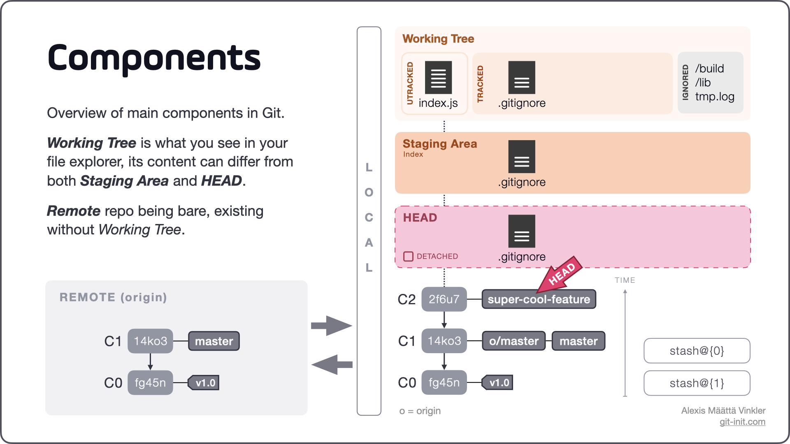

# 

```powershell
git --section 01 -cli -demo "local repo" :D
```
##
> **OAD** / brian_li


# **A**genda
- Repository (local)
- File status
- HEAD
- Time Travel
- Resources
- Homework 1


# CLI - **Repository**
|指令|中文|簡述|
|---|---|---|
|**init**|初始化|在 `local` 建立 `repo` 與預設分支*|
|**clone**|複製|下載整個 `remote repo` 到 `local`|
|**status**|狀態|檢視目前 `repo` 狀態|
###
> *[預設分支](https://www.ithome.com.tw/news/140094)後來由 `master` 改為 `main`


# DEMO - **Repository**
本地初始化
```powershell
git init
```
```powershell
git status
```
下載遠端 `repo`
```powershell
git clone https://xxx.yyy/zzz.git
```

<!-- _backgroundColor: #ddd -->

# Repository **.git**
- `git init` 之後產生
- 儲存 Git 相關資料
    `commits` `branches`
    `tags` `HEAD` `index`
    `config` `Hooks`


#


# CLI - **File**
##
|指令|中文|簡述|
|---|---|---|
|**add**|加入|將檔案加入暫存區，準備提交|
|**commit**|提交|提交修改*至 `repo`，需填寫提交內容|
|**log**|歷程|檢視** `repo` 歷程記錄|
###
> *每次 `commit` 都會生成一個 `hash code`，例如 `c802b33`
**離開檢視按 `q`，可搭配多種參數


# Git -**commit**


# DEMO - **File**
暫存區加入特定或全部 `untracked` 檔案
```powershell
git add code.txt
git add .
```
提交修改
```powershell
git commit -m "my first commit"
```
檢視歷程
```powershell
git log
git log --oneline --graph
```

<!-- _backgroundColor: #ddd -->

# Git - **HEAD**
- Git 的指標(指針)
- 指向當前 `branch`
- 或指向最新 `commit`
- 可搭配 `~n` 與 `^n`


#


# Git - **diff**


# CLI - **回溯版本**
##
|指令|中文|簡述|
|---|---|---|
|**revert**|撤銷|產生一個**反向版本**，抵銷修改內容|
|**reset**|重置|回溯到特定位置 = 特定 `HEAD`|
|**checkout**|簽出|透過簽出特定版本達到回溯*|
###
> *`2.23` 之後提供 `restore` 取代 `checkout`
其他相關還有 `cherry-pick` `reflog`


# Git - **revert**
- 恢復至版本 `B`
- 產生新版本 `B'`
- 版本 `C` 不會消失
- `B'` = `C` - `B`


# Git - **reset**
- 回溯至版本 `B`
- 不會產生新版本
- 比 `B` 新的版本會消失
- 記得 `hash` 仍可救回


#


# **Online** Resources
- https://learngitbranching.js.org/?locale=zh_TW
- https://git-scm.com/book/zh-tw/v2/
- https://kingofamani.gitbooks.io/git-teach/content/
- https://jlord.us/git-it/index-zhtw.html
- https://www.youtube.com/watch?v=e9lnsKot_SQ
- https://www.youtube.com/watch?v=ol7CMoJuAvI


# What's **next** ...
##
|Subject|Keywords|
|---|---|
|**Branch**|`checkout` `switch` `merge` `rebase`|
|**Remote**|`origin` `push` `pull` `fetch`|
|**Misc.**|`tracking-branch` `conflict`|


<!-- _class: invert -->

# Home**work** 1
- Install* Git from https://git-scm.com/download/win
- Install* a GUI or use CLI
- Clone repo from http://twoadcode:3000/brian_li/demoGit.git
- Create your own directory `D` (with your name)
- Create a text file `T` in `D`, such as `*.txt` `*.sql` `*.js` `*.cs`
- Write something in `T` and save
- Add `T` to the stage then commit
- Capture screen and mail to [Mecer](mailto:mecer.wu@sgs.com)
###
> *probably need IT support


# 😀 Thank you !
feel free to ask if you have any other questions.
##
> **OAD** / brian_li / #1429
brian.li@sgs.com
