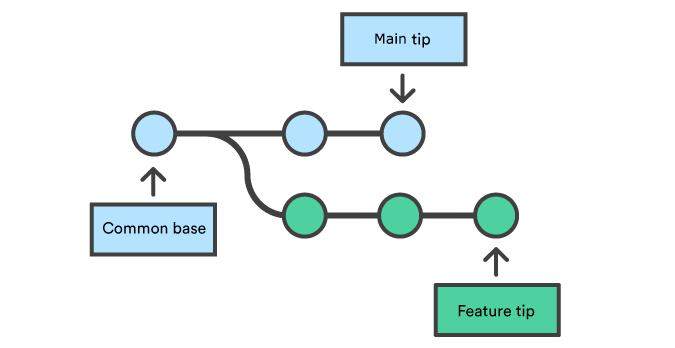

# 

```powershell
git --section 02 -branch "remote repo" :(
```
##
> **OAD** / brian_li


# **A**genda
- Branch
- Remote Repository
- Git Server/Service
- Resources
- Homework


#


# CLI - **Branch**
|指令|中文|簡述|
|---|---|---|
|**branch**|分支|操作分支*|
|**checkout**|簽出|切換指定分支**|
|**merge**|合併|以**目前分支**併吞其他分支|
|**rebase**|重設|看不到合併提交，更簡潔|
###
> *Git 指令永遠都是針對 `目前分支` 進行操作
**`2.23` 之後提供 `switch` 取代 `checkout`
⚠️切換分支時，如有未提交修改會警告


# DEMO - **Branch**
建立分支
```powershell
git branch dev
```
切換分支 (擇一)
```powershell
git checkout dev
git switch dev
```
合併分支*
```powershell
git merge dev
```
> *⚠️注意當前分支是否為 `main`。除了 `merge` 還有 `rebase`。只要合併就有機率產生衝突。

<!-- _backgroundColor: #ddd -->

# Git - **merge**


##### Git can automatically merge commits unless there are changes that **conflict** in both commit sequences.
沒衝突會自動合併

# Git - **rebase**


###### Remember `rebase` can alter the commit history. This can be **dangerous** if not done properly, especially with branches that others are working on.
團隊開發沒事不要 `rebase`，除非大家都很熟
###### https://needoneapp.medium.com/git-merge-vs-git-rebase-17392c4d870d

# Resolving **conflict**


##### 有合併就有**衝突**
- 使用 `<` `=` `>` 標註
- 修改到正確即可

https://gitbook.tw/chapters/branch/fix-conflict

#


#


# CLI - **Remote**
##
|指令|中文|簡述|
|---|---|---|
|**remote**|遠端|管理遠端分支*|
|**push**|推送|上傳修改資料到遠端|
|**pull**|拉取|下載修改資料到本地|
|**fetch**|擷取|下載修改資料到**追蹤分支**|
###
> *遠端 `repo` 預設別名為 `origin`


# DEMO - **Remote**
設定遠端 `repo`
```powershell
git remote add origin https://xxx.yyy/zzz.git
```
推送資料* (推送分支)
```powershell
git push -u origin main
```
拉取資料 = `fetch` + `merge`
```powershell
git pull
```
> *設定上游為 `origin/main`，未來 `push` 即可

<!-- _backgroundColor: #ddd -->

# Git - **Tracking** Branch
- 與遠端分支關聯的**本地分支**
- `origin` = 遠端 `repo`
- `origin/main` = 遠端 `main` 追蹤分支
- 追蹤分支**僅**用來反映其遠端分支變化
- 本地**無法**直接操作追蹤分支
###
> *左圖為 `ftech` 示意，僅更新追蹤分支


#


# Git - **pull**


###### = `fetch` + `merge`

# Git - **push**

###### 版本如與 `remote` 有差異會**警告**

# Why need **fetch** ?
- **查看遠端更新**
    不須合併即可檢視遠端修改歷程
- **比對分支差異**
    透過 `diff` 比對，預覽合併結果
- **保持資料同步**
    定期執行，避免合併時大量變更


# Git **Sever**/**Service**
###
|[Gitea](https://about.gitea.com/)✅|[Azure DevOps](https://dev.azure.com/)✅|[GitHub](https://github.com/)☑️|[GitLab](https://about.gitlab.com/)|
|-|-|-|-|
|||||
###
>☑️個人練習 / ✅公司使用 (可到 [這裡](http://twoadcode:3000/) 註冊帳號練習，目前未確定何種平台)
<!-- _backgroundColor: #eee; -->

# Dev**Ops**

### Development Operations
##### 一種重視**軟體開發人員**（Dev）和**IT運維技術人員**（Ops）之間溝通合作的文化、運動或慣例 🥲🥲🥲

#


# **Online** Resources
- https://www.toptal.com/developers/gitignore
- https://heidiliu2020.github.io/git-commit-message/
- https://www.youtube.com/watch?v=0chZFIZLR_0
## **Offline** Resources
- https://www.tenlong.com.tw/products/9789864342662
- https://www.tenlong.com.tw/products/9789865025274


# What's **next** ...
##
|Subject|Keywords|
|---|---|
|**Work Flow**|`Git Flow` `GitHub Flow` `OAD Flow?`|
|**CI/CD**|`Action` `Pipline` `yaml`|
|**AI**|`GitHub Copilot CLI` `Commit Message`|
|**Misc.**|`Pull Request` `Code Review`|


<!-- _class: invert -->

# Home**work**
- Create a account in [Gitea](http://twoadcode:3000/)
- Back to the local repo
- Create a branch `B` with your name
- Add content and then commit
- Merge `B` into `main`
- Push to remote* (only `main` or `B` together)
- Capture screen and mail to [Mecer](mailto:mecer.wu@sgs.com)
###
> *version diff warning may appear


# 😀 Thank you !
feel free to ask if you have any other questions.
##
> **OAD** / brian_li / #1429
brian.li@sgs.com
