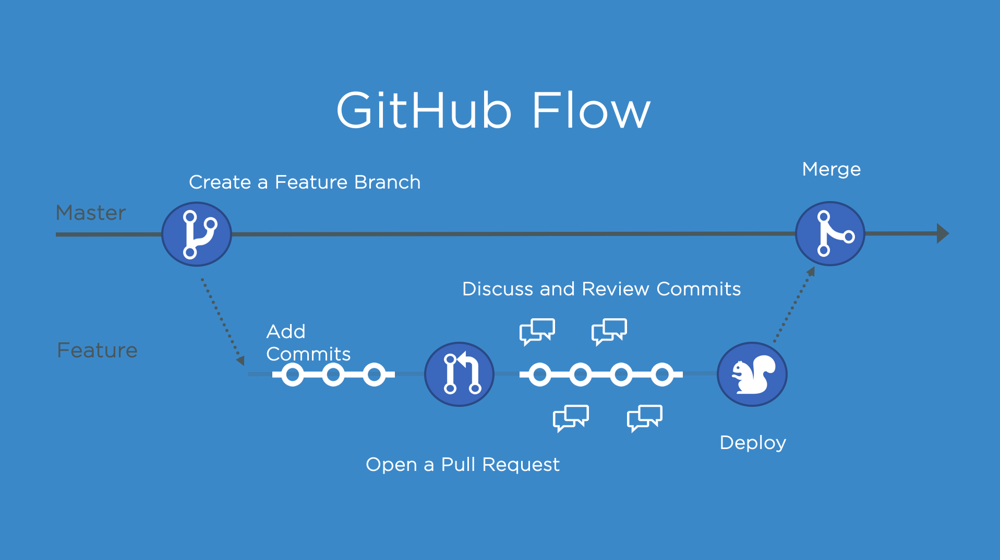
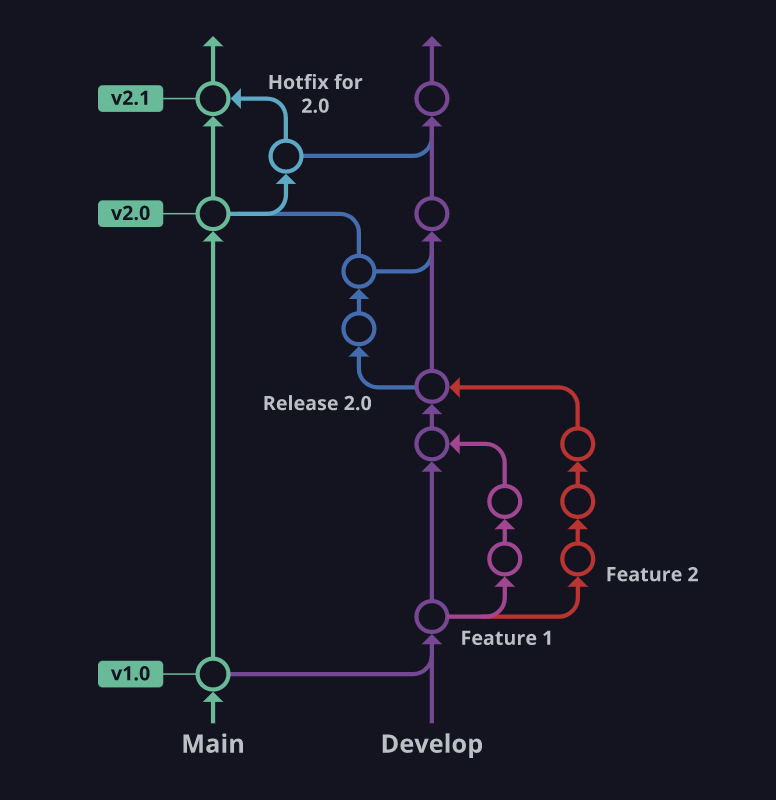
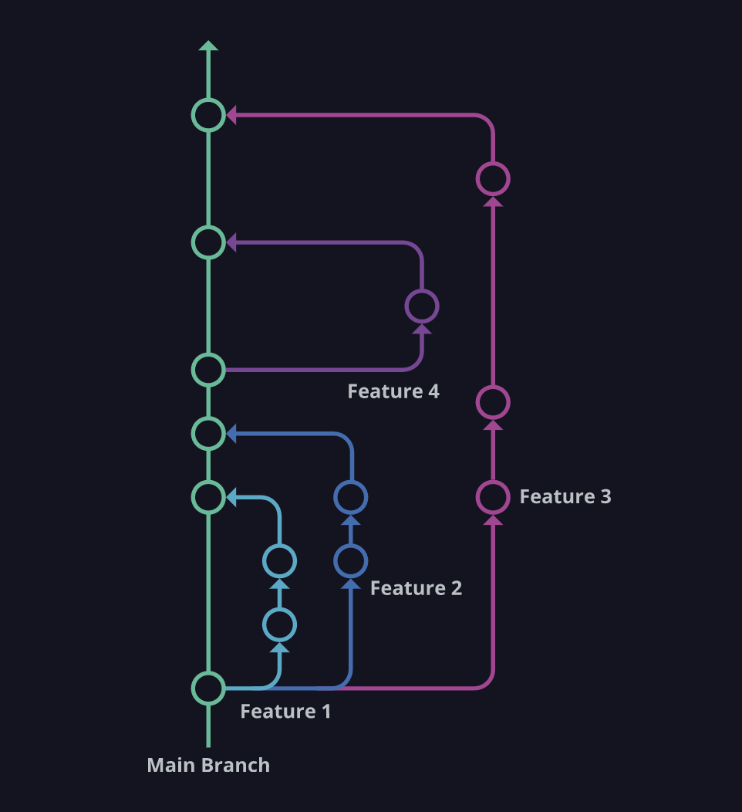

---
marp: true
paginate: true
headingDivider: 1
footer: git-section-`03`
---

# 

```powershell
git --section 03 -workflow "git flow" :|
```
##
> **OAD** / brian_li


# **A**genda

- Work Flow
    - Git Flow
    - GitHub Flow
- Demo
- Resources
- Homework


# Work**flow**


> ###### **工作流程**描述了代碼的**生命週期**，包括開發、測試、代碼審查、集成、部署等。不同團隊可能有不同流程，取決於**需求**、**技術**和組織**文化**。

- Centralized Workflow
- Feature Branch Workflow
- ✅ **Git FLow**
- ☑️ **GitHub Flow**
- GitLab Flow
- Forking Workflow

# Git **Flow**

- 於 2010 年[發表](https://nvie.com/posts/a-successful-git-branching-model/)
- 一種 Git 分支模型
- 包含**常駐**與**臨時**分支
- 以 `merge` 為基底
- CLI / GUI 支援
###
>[gitflow](https://github.com/nvie/gitflow) on GitHub


# GitFlow - **init**


```shell
git flow init
```

- 初始化 GitFlow 環境
- 會詢問每種分支名稱
- 約略*等於以下指令

```shell
git init
git branch develop
git switch develop
```
>*`git flow` = `git` 指令集封裝

# GitFlow - **Branches**

###

| 類型   | 說明        | 常見名稱(或前綴)                                  |
| ---- | --------- | ------------------------------------------ |
| 常駐分支 | 一直存在 `repo` | `main` `develeop` `master`                         |
| 臨時分支 | 使用完畢刪除 | `feature/*` `release/*` `hotfix/*` |

###
- 主要分支可能為 `main` 或 `master`
- 分支(或前綴)可改為縮寫，例如將 `develop` 改為 `dev`
- 其他如 `feature/xxx` `release/xxx` `hotfix/xxx`
看過人改為 `f/xxx` `r/xxx` `h/xxx` 可少打幾個字 😀

# **常駐**分支

|         | 名稱 | 說明                  |提交|tag|
| --------- | ---- | ------------ |--|--|
| `main`    | 主要 | 每個節點都可以發布到正式環境 |❌|✅|
| `develop` | 開發 | 每次開發功能都應該從這裡開始 |❌||
###
- `main` 一般會設定保護，只有特定權限或角色允許操作
- `main` 上面的節點通常會加上 `tag` 例如標註版本編號
- 節點併入 `main` 通常透過 `pull request`
- 通常於 `pull request` 進行 `code review`

#


# **臨時**分支(前綴)
<!-- _backgroundColor: #eee; -->
| 名稱         | 說明                  | from      | merge into                |  |
| ---------- | ------------------- | --------- | ----------------- | --- |
| `feature/` | 功能分支，每次開發功能時開立  | `develop` | `develop`         |     |
| `release/` | 發布分支，每次部署時開立 | `develop` | `develop` `main` |   ⚠️|
| `hotfix/`  | 熱修分支，處理突發性異常開立     | `main`    | `main` `develop` | ⚠️   |
###
- 臨時分支預設在任務結束後**刪除** (也可以保留)
- 臨時分支會有**來源**與合併**終點**，通常會在合併後刪除
- ⚠️ `release` 與 `hotfix` 最終都要併入 `develop` 與 `main` (同步修改)

# 
<!-- GitFlow - **freature** -->


# 
<!-- GitFlow - **release** -->


# 
<!-- GitFlow - **hotfix** -->


# DEMO - **GitFlow**


# 
<!-- Git**Hub** Flow -->


# 
<!-- Git**Hub** Flow -->



# **OAD** Workflow ?

- Git ?
- Git Server ?
- Work Flow ?
- SSDLC ?
<!-- _class: invert -->

# **Online** Reources

- [Git Flow 是什麼？為什麼需要這種東西？](https://gitbook.tw/chapters/gitflow/why-need-git-flow)
- [Gitflow Workflow | Atlassian Git Tutorial](https://www.atlassian.com/git/tutorials/comparing-workflows/gitflow-workflow)
- [分支的工作流程 | nulab](https://nulab.com/zh-tw/learn/software-development/git-tutorial/git-collaboration/branching-workflows/)
- [git-flow 備忘清單](https://danielkummer.github.io/git-flow-cheatsheet/index.zh_TW.html#features)
- [團隊協作 Git Flow](https://enginebai.medium.com/git-flow-60b9466e9942)

## misc.
- [別再讓 gitflow 拖累團隊的開發速度](https://blog.hellojcc.tw/the-flaw-of-git-flow/)
- [可能更好的 gitflow](https://blog.hellojcc.tw/a-better-git-flow/)
# What's **next** ...
##
|Subject|Keywords|
|---|---|
|**Work Flow**|`Pull Request` `Code Review`|
|**CI/CD**|`Actions` `Pipline` `yaml`|
|**AI**|`GitHub Copilot CLI` `Commit Message`|
|**Misc.**|`git svn` `azure devops`|


<!-- _class: invert -->

# Home**work**
- Create a `repo`* on [Gitea](http://twoadcode:3000/) or `local`.
- Initialize Git Flow.
- Create a `freature`, make chages** and finish it.
- Create a `release`, chage version and finish it.
- Create a `hotfix`, pretend fix bugs and finish it.
- Push changes to `remote`.
- Send `reop`'s url to [Mecer](mailto:mecer.wu@sgs.com).
###
> *If the `repo` created on `remote`, `clone` it before next step.
**Create a real project would be a plus.
⚠️ Make sure the `remote` `repo` is set to `puclic`.


# 😀 Thank you !
feel free to ask if you have any other questions.
##
> **OAD** / brian_li / #1429
brian.li@sgs.com
