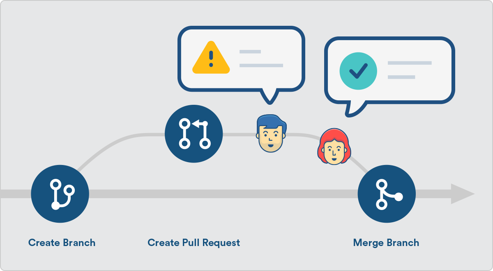

# 


```powershell
git --section 04 -workflow "pull request" ;{
```
##
> **OAD** / brian_li

# **A**genda

- Workflow
- Pull Request
- Code Review
- Demo
- Resources
- Homework

# <!-- workflow -->


# Role**s**

||Large/Complex|Small|🐉|
|-|-|-|-|
|**PM**|Jeff/Lawrence|Jeff|Brian|
|**SA**|Mecer/Amy|Mecer|Brian|
|**SD**|Mecer/Amy|Mecer/Brian|Brian|
|**PG**|Birdie/Neil/Brian|Brian|Brian|
|**QA**|Mecer/Amy/BU|Brian|Brian|
> ⚠️角色種類與人員數量配置因專案大小而異，沒有絕對標準，例如也可能有 **DBA** 或 **ART** 等等

#


# Pull Request - **What** & **Why**


###### A **REQUEST** for ask someone to **PULL** our commits and merge into other branch
######
- 開發者通常在**個人分支**上開發
- 完成開發後需合併回 `main`
- 合併之前應該要接受**檢查**
- 通知**專案負責人**或**其他工程師**
- 經過**檢查**、**討論**或**修改**才進行合併
- 通常由**特殊權限**或**角色**進行合併

# Pull Request - **How**

- create a branch `A`, make changes and commit
- push `A` to remote, then go to Git Server
- create a **PR** (pull request) on server
- discuss ≈ **code review**
- approve = merge `A` into `main`
######
>⚠️依照討論結果可能再修正，提交會併入同一 PR

#


# Gitea **Organization**

- 團隊協作
- 集中管理
- 權限控管
###### Repo's **owner**
`組織` or `自己`

# DEMO **PR**

- **Intro [ORG on Gitea](http://twoadcode:3000/OAD)**
- **Pull Request**
    Create
    Discussion
    Merge into `main`
###
> ⚠️建議學習 `Markdown`

# **Mark**down

| 優點  | 缺點 |
|------|-----|
|簡潔易讀|學習曲線|
|跨平台|排版限制|
|生態系|軟體支援|

> support：
`GitHub` `Gitea` `Jupyter Notebook` `Notion` `GPT`

# Code **Review**

| 優點(品質提升👍)                | 缺點(額外成本🔻)  |
|----------------------|----------------------------------------------|
| 發現並修正錯誤        | 可能引起開發者之間的**衝突**或**緊張**     |
| 促進知識分享和團隊合作| 可能產生**過多的**討論和評論                      |
| 學習機會            | 可能會導致**拖延**和**延遲**項目進度                 |
| 提高代碼一致性        | 可能**忽視**小錯誤和問題，導致低效率             |

⚠️開發架構收斂比較可能實現，包括 `Language` `FrameWork` `Architecture Pattern` `Design Pattern` `Packages` ... 等等

# **Online** Reources

- [與其它開發者的互動 - 使用 Pull Request（PR）](https://gitbook.tw/chapters/github/pull-request)
- [什麼是 Pull Request?](https://shoujhengduan.medium.com/%E4%BB%80%E9%BA%BC%E6%98%AF-pull-request-b476ee3e0217)
- [如何進行 Code Review?](https://enginebai.medium.com/code-review-guidelines-b76a859c377c)
- [淺談Code Review的好處及意義](https://blog.alantsai.net/posts/2019/05/code-review-what-is-code-review-and-why-we-want-to-do-it)
- [Create Pull Request in Azure DevOps](https://blog.alantsai.net/posts/2019/05/code-review-02-what-is-pull-request-and-how-to-create-it-in-azure-devops)
- [Markdown 官方教程](https://markdown.com.cn/basic-syntax/)


# What's **next** ...

|Subject|Keywords|
|---|---|
|**CI/CD**|`Runner` `Actions` `Pipline` `yaml`|
|**AI**|`GitHub Copilot CLI` `Commit Message`|
|**Misc.**|`git svn` `azure devops`|
<!-- _class: invert -->

# Home**work**

- Create a `repo` on [Gitea](http://twoadcode:3000/) or `fork` [demoTeamWork](http://twoadcode:3000/OAD/demoTeamWork)
- Clone the `repo` (to local)
- Create branch `A`, make chages and commit
- Push `A` to `remote`
- Go to Gitea, create a `pull request`
- Find someone to review* (or just approve yourself)
- Capture screen and mail to [Mecer](mailto:mecer.wu@sgs.com)
###
> *If the `repo` created by your own, you may add Collaborators for Pull Request Review
⚠️Try `Markdown` during pull request creation


# 😀 Thank you !

feel free to ask if you have any other questions.
##
> **OAD** / brian_li / #1429
brian.li@sgs.com