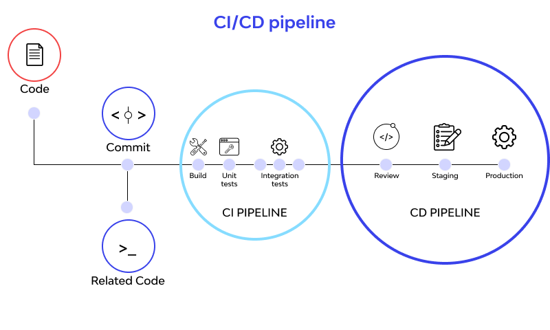
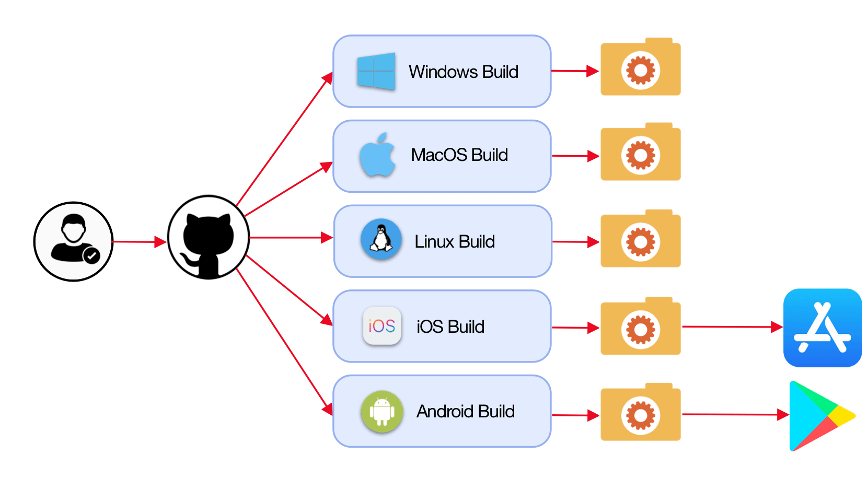

# 


```powershell
git --section 05 -cicd "github actions" :/
```
##
> **OAD** / brian_li

# **A**genda

- CI/CD
- Gitea Actions
    Runner
    YAML
- Demo
- Resources

# CI **/** CD - 持續整合 **/** 部署

###### 一種軟體開發實踐方法，目的在**自動化**和**簡化**開發、測試和部署**過程**
###
- 持續**整合**（Continuous Integration）：
    程式碼頻繁地合併到 repo
    每次合併自動觸發測試和建置流程
- 持續**部署**/交付（Continuous Deployment/Delivery）
    自動化部署程式碼到測試或正式環境
    持續交付軟體更新至使用者

#


# Gitea Actions **Act Runner**

- 用於執行**工作流程**
- 可以是**虛擬機**、**實體機**或者**容器**
- 官方有提供，也可自建
- 獨立專案，Go 撰寫

# Gitea **Actions**

- 致敬
    [GitHub Actions](https://docs.github.com/en/actions)
- 大部分相容
- 使用 **YAML** 撰寫
###
⚠️`yaml` 可放路徑 `.gitea/workflows/` `.github/workflows/`


# Sample.**yaml**

```yaml
name: Greetings!  ------------ # workflow name

on: [push, pull]  ------------ # event(s)

jobs:
  build:    ------------------ # job id**
    runs-on: windows   ------- # runner label***
    steps:  ------------------ # action(s)
      - name: Say Hello   ---- # action name*
      - run: echo Hello!  ---- # run script
```

>*`name` is optional
**`job id` must be unipue
***`runs-on` should match the runner `label`

# Gitea Actions **Variable**

-
-
-

# Gitea Actions **Secret**

-
-
-

# YA**ML**

###### **Y**et **A**nother **M**arkup **L**anguage
- key-value pair 集合
- value 可以是字串或結構
- 結構使用縮排定義
- 不可以用 **Tab**
- 子節點比父節點縮排更多即可，空白數量**不**重要
- 支援 UTF-8, UTF-16 and UTF-32

#

<!-- _class: invert -->

# DEMO

- Actions Enable ?
- Runner Statuds
- Create Workflow
- Test

# **Online** Reources

- [與其它開發者的互動 - 使用 Pull Request（PR）](https://gitbook.tw/chapters/github/pull-request)


# 😀 Thank you !

feel free to ask if you have any other questions.
##
> **OAD** / brian_li / #1429
brian.li@sgs.com